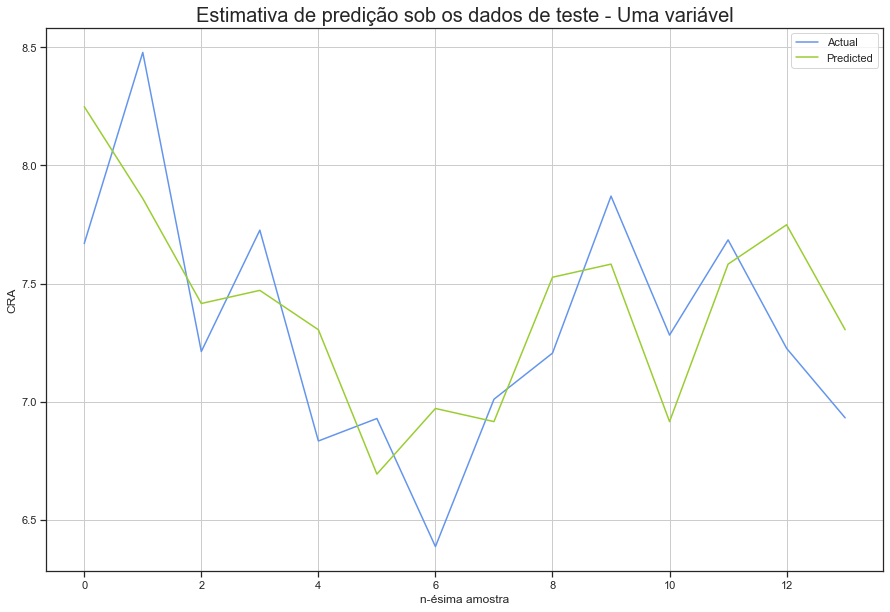
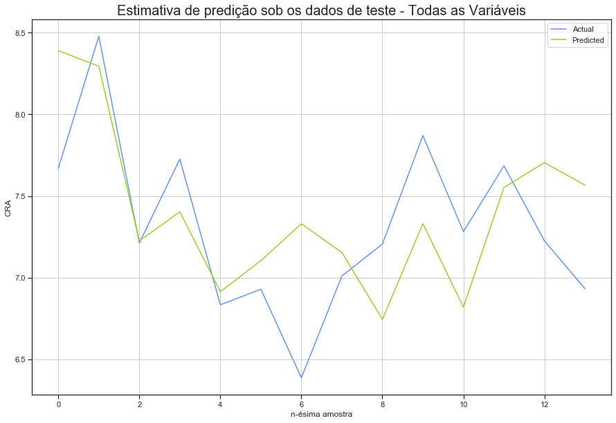

# Dependências


```python
import numpy as np
import pandas as pd
import matplotlib.pyplot as plt
import seaborn as sns; sns.set(style="ticks", color_codes=True)
from sklearn.linear_model import LinearRegression
from sklearn.metrics import mean_squared_error, r2_score
from sklearn.model_selection import train_test_split
from sklearn.preprocessing import StandardScaler
from sklearn import metrics
from sklearn.model_selection import KFold
```

# Declarando Funções


```python
def get_result(train_rmse, test_rmse):
    df = pd.DataFrame(columns=['RMSE Treino', 'RMSE Teste'], index = ['1 var', '2 var', '3 var', 'All'])
    df['RMSE Treino'] = np.array(train_rmse)
    df['RMSE Teste'] = np.array(test_rmse)
    df = df.T
    
    return df
```


```python
def estimate_plot(y, y_pred, label_set, label_var, color):
    plt.figure(figsize=(15, 10))
    plt.title('Estimativa de predição sob os dados de ' + label_set + ' - '+ label_var, fontsize=20)
    plt.plot(y, label='Actual', color=color[0])
    plt.plot(y_pred, label='Predicted', color=color[1])
    plt.xlabel('n-ésima amostra')
    plt.ylabel('CRA')
    plt.grid()
    plt.legend()
```


```python
def scores_plot(df):
    df = df.T.head(25)
    df.plot(kind='bar',figsize=(15,10), color=['#669ACC', 'yellowgreen'])
    plt.title('Comparativo RMSE Treino vs Teste - Holdout', fontsize=20)
    plt.grid(which='major', linestyle='-', linewidth='0.5', color='#D3D3D3')
    plt.grid(which='minor', linestyle=':', linewidth='0.5', color='black')
    plt.xticks(rotation='horizontal')
    plt.show()
```

# Carregando os dados


```python
train_rmse = []
test_rmse = []
df = pd.read_csv('./data/sample_treino.csv')
df.head()
```


<div>
<style scoped>
    .dataframe tbody tr th:only-of-type {
        vertical-align: middle;
    }

    .dataframe tbody tr th {
        vertical-align: top;
    }

    .dataframe thead th {
        text-align: right;
    }
</style>
<table border="1" class="dataframe">
  <thead>
    <tr style="text-align: right;">
      <th></th>
      <th>Cálculo1</th>
      <th>LPT</th>
      <th>P1</th>
      <th>IC</th>
      <th>Cálculo2</th>
      <th>cra</th>
    </tr>
  </thead>
  <tbody>
    <tr>
      <th>0</th>
      <td>8.7</td>
      <td>10.0</td>
      <td>9.0</td>
      <td>9.1</td>
      <td>8.4</td>
      <td>8.477647</td>
    </tr>
    <tr>
      <th>1</th>
      <td>7.0</td>
      <td>7.0</td>
      <td>7.7</td>
      <td>7.0</td>
      <td>6.2</td>
      <td>6.851724</td>
    </tr>
    <tr>
      <th>2</th>
      <td>8.6</td>
      <td>9.8</td>
      <td>7.9</td>
      <td>9.6</td>
      <td>8.7</td>
      <td>9.090588</td>
    </tr>
    <tr>
      <th>3</th>
      <td>7.8</td>
      <td>8.3</td>
      <td>6.8</td>
      <td>8.2</td>
      <td>8.0</td>
      <td>7.283516</td>
    </tr>
    <tr>
      <th>4</th>
      <td>5.2</td>
      <td>9.3</td>
      <td>5.0</td>
      <td>8.5</td>
      <td>5.0</td>
      <td>7.205747</td>
    </tr>
  </tbody>
</table>
</div>


# Sumário dos Dados


```python
df.describe()
```


<div>
<style scoped>
    .dataframe tbody tr th:only-of-type {
        vertical-align: middle;
    }

    .dataframe tbody tr th {
        vertical-align: top;
    }

    .dataframe thead th {
        text-align: right;
    }
</style>
<table border="1" class="dataframe">
  <thead>
    <tr style="text-align: right;">
      <th></th>
      <th>Cálculo1</th>
      <th>LPT</th>
      <th>P1</th>
      <th>IC</th>
      <th>Cálculo2</th>
      <th>cra</th>
    </tr>
  </thead>
  <tbody>
    <tr>
      <th>count</th>
      <td>88.000000</td>
      <td>88.000000</td>
      <td>88.000000</td>
      <td>88.000000</td>
      <td>88.000000</td>
      <td>88.000000</td>
    </tr>
    <tr>
      <th>mean</th>
      <td>7.200000</td>
      <td>8.480114</td>
      <td>7.407955</td>
      <td>8.172727</td>
      <td>6.323864</td>
      <td>7.332535</td>
    </tr>
    <tr>
      <th>std</th>
      <td>1.228493</td>
      <td>0.984522</td>
      <td>1.346278</td>
      <td>0.894007</td>
      <td>1.293662</td>
      <td>0.849758</td>
    </tr>
    <tr>
      <th>min</th>
      <td>5.000000</td>
      <td>6.200000</td>
      <td>5.000000</td>
      <td>5.900000</td>
      <td>5.000000</td>
      <td>4.874468</td>
    </tr>
    <tr>
      <th>25%</th>
      <td>6.275000</td>
      <td>7.700000</td>
      <td>6.500000</td>
      <td>7.500000</td>
      <td>5.100000</td>
      <td>6.841484</td>
    </tr>
    <tr>
      <th>50%</th>
      <td>7.200000</td>
      <td>8.500000</td>
      <td>7.750000</td>
      <td>8.200000</td>
      <td>5.800000</td>
      <td>7.274746</td>
    </tr>
    <tr>
      <th>75%</th>
      <td>8.125000</td>
      <td>9.300000</td>
      <td>8.325000</td>
      <td>8.800000</td>
      <td>7.500000</td>
      <td>7.883292</td>
    </tr>
    <tr>
      <th>max</th>
      <td>9.800000</td>
      <td>10.000000</td>
      <td>10.000000</td>
      <td>10.000000</td>
      <td>9.300000</td>
      <td>9.090588</td>
    </tr>
  </tbody>
</table>
</div>


```python
df.isnull().any()
```


    Cálculo1    False
    LPT         False
    P1          False
    IC          False
    Cálculo2    False
    cra         False
    dtype: bool


# Análise dos Dados


```python
plt.figure(figsize=(15,10))
plt.tight_layout()
plt.grid()
plt.xlabel('CRA', fontsize=18, color='white')
sns.distplot(df['cra'],hist_kws=dict(edgecolor="white")).set_title('Distribuição CRA', color='white', fontsize=20, fontweight="bold")
```


    Text(0.5, 1.0, 'Distribuição CRA')


Observando a distribuição dos dados é possível perceber que existe uma forte concentração dos CRA's entre 7 e 7.5.

Vamos observar a correlação entre cada variável:


```python
corr = df.corr(method='spearman')
mask = np.zeros_like(corr)
mask[np.triu_indices_from(mask)] = True
fig, ax = plt.subplots()
ax.figure.set_size_inches(10, 10)
sns.heatmap(corr, ax=ax, annot=True, mask=mask, fmt='.2f', cbar=False, square=True, cmap=plt.cm.Blues, center=0)
```


    <matplotlib.axes._subplots.AxesSubplot at 0x151b2f710>


Analisando a matriz é possível observar que as três variáveis melhor correlacionadas são IC, P1 e Cálculo 1.


```python
sns.pairplot(df, plot_kws = {'alpha': 0.5})
```


    <seaborn.axisgrid.PairGrid at 0x151dcd128>


# Regressão Simples - Uma variável (IC)

## Partição Treino/Teste


```python
x = df[['IC']]
y = df.cra.values

x_train, x_test, y_train, y_test = train_test_split(x, y, test_size=0.15, random_state=42)

print(x_train.shape, y_train.shape)
print(x_test.shape, y_test.shape)
```

    (74, 1) (74,)
    (14, 1) (14,)


## Normalizando os dados


```python
norm = StandardScaler()
norm = norm.fit(x_train)

x_train_norm = norm.transform(x_train)
x_test_norm = norm.transform(x_test)
```

## Treinando o modelo


```python
model = LinearRegression()
model.fit(x_train_norm, y_train)
```


    LinearRegression(copy_X=True, fit_intercept=True, n_jobs=None, normalize=False)


### Estimando no Conjunto de Treino


```python
y_pred = model.predict(x_train_norm)
```


```python
df_ic_corr = pd.DataFrame({'Actual': y_train.flatten(), 'Predicted': y_pred.flatten()})
df_ic_corr.head(10)
```


<div>
<style scoped>
    .dataframe tbody tr th:only-of-type {
        vertical-align: middle;
    }

    .dataframe tbody tr th {
        vertical-align: top;
    }

    .dataframe thead th {
        text-align: right;
    }
</style>
<table border="1" class="dataframe">
  <thead>
    <tr style="text-align: right;">
      <th></th>
      <th>Actual</th>
      <th>Predicted</th>
    </tr>
  </thead>
  <tbody>
    <tr>
      <th>0</th>
      <td>7.102247</td>
      <td>7.360112</td>
    </tr>
    <tr>
      <th>1</th>
      <td>7.761176</td>
      <td>6.971570</td>
    </tr>
    <tr>
      <th>2</th>
      <td>7.144706</td>
      <td>6.305499</td>
    </tr>
    <tr>
      <th>3</th>
      <td>6.905263</td>
      <td>7.804160</td>
    </tr>
    <tr>
      <th>4</th>
      <td>8.309412</td>
      <td>8.248207</td>
    </tr>
    <tr>
      <th>5</th>
      <td>6.415842</td>
      <td>6.805053</td>
    </tr>
    <tr>
      <th>6</th>
      <td>6.134513</td>
      <td>8.137195</td>
    </tr>
    <tr>
      <th>7</th>
      <td>6.510753</td>
      <td>7.138088</td>
    </tr>
    <tr>
      <th>8</th>
      <td>7.434831</td>
      <td>7.249100</td>
    </tr>
    <tr>
      <th>9</th>
      <td>7.963218</td>
      <td>7.360112</td>
    </tr>
  </tbody>
</table>
</div>


```python
estimate_plot(y_train, y_pred, 'treino', 'Uma variável',['#669ACC','#CC6566'])
```


```python
train_rmse.append(np.sqrt(metrics.mean_squared_error(y_train, y_pred)))
print('RMSE on Training Set:', np.sqrt(metrics.mean_squared_error(y_train, y_pred)))
```

    RMSE on Training Set: 0.7365395704572046


### Estimando no Conjunto de Teste


```python
y_pred = model.predict(x_test_norm)
```


```python
df_ic_corr = pd.DataFrame({'Actual': y_test.flatten(), 'Predicted': y_pred.flatten()})
df_ic_corr.head(10)
```


<div>
<style scoped>
    .dataframe tbody tr th:only-of-type {
        vertical-align: middle;
    }

    .dataframe tbody tr th {
        vertical-align: top;
    }

    .dataframe thead th {
        text-align: right;
    }
</style>
<table border="1" class="dataframe">
  <thead>
    <tr style="text-align: right;">
      <th></th>
      <th>Actual</th>
      <th>Predicted</th>
    </tr>
  </thead>
  <tbody>
    <tr>
      <th>0</th>
      <td>7.669231</td>
      <td>8.248207</td>
    </tr>
    <tr>
      <th>1</th>
      <td>8.477647</td>
      <td>7.859665</td>
    </tr>
    <tr>
      <th>2</th>
      <td>7.212414</td>
      <td>7.415618</td>
    </tr>
    <tr>
      <th>3</th>
      <td>7.725882</td>
      <td>7.471124</td>
    </tr>
    <tr>
      <th>4</th>
      <td>6.834066</td>
      <td>7.304606</td>
    </tr>
    <tr>
      <th>5</th>
      <td>6.929167</td>
      <td>6.694041</td>
    </tr>
    <tr>
      <th>6</th>
      <td>6.387379</td>
      <td>6.971570</td>
    </tr>
    <tr>
      <th>7</th>
      <td>7.010588</td>
      <td>6.916064</td>
    </tr>
    <tr>
      <th>8</th>
      <td>7.205747</td>
      <td>7.526630</td>
    </tr>
    <tr>
      <th>9</th>
      <td>7.869880</td>
      <td>7.582136</td>
    </tr>
  </tbody>
</table>
</div>


```python
estimate_plot(y_test, y_pred, 'teste', 'Uma variável', ['cornflowerblue', 'yellowgreen'])
```





```python
test_rmse.append(np.sqrt(metrics.mean_squared_error(y_test, y_pred)))
print('RMSE on Test Set:', np.sqrt(metrics.mean_squared_error(y_test, y_pred)))
```

    RMSE on Test Set: 0.3957505289788593


# Regressão Múltipla - Duas variáveis (IC, P1)

## Partição Treino/Teste


```python
x = df[['IC', 'P1']]
y = df.cra.values

x_train, x_test, y_train, y_test = train_test_split(x, y, test_size=0.15, random_state=42)

print(x_train.shape, y_train.shape)
print(x_test.shape, y_test.shape)
```

    (74, 2) (74,)
    (14, 2) (14,)


## Normalizando os Dados


```python
norm = StandardScaler()
norm = norm.fit(x_train)

x_train_norm = norm.transform(x_train)
x_test_norm = norm.transform(x_test)
```

## Treinando o Modelo


```python
model = LinearRegression()
model.fit(x_train_norm, y_train)
```


    LinearRegression(copy_X=True, fit_intercept=True, n_jobs=None, normalize=False)


### Estimando no Conjunto de Treino


```python
y_pred = model.predict(x_train_norm)
```


```python
df_ic_p1_corr = pd.DataFrame({'Actual': y_train.flatten(), 'Predicted': y_pred.flatten()})
df_ic_p1_corr.head(10)
```


<div>
<style scoped>
    .dataframe tbody tr th:only-of-type {
        vertical-align: middle;
    }

    .dataframe tbody tr th {
        vertical-align: top;
    }

    .dataframe thead th {
        text-align: right;
    }
</style>
<table border="1" class="dataframe">
  <thead>
    <tr style="text-align: right;">
      <th></th>
      <th>Actual</th>
      <th>Predicted</th>
    </tr>
  </thead>
  <tbody>
    <tr>
      <th>0</th>
      <td>7.102247</td>
      <td>6.856910</td>
    </tr>
    <tr>
      <th>1</th>
      <td>7.761176</td>
      <td>7.204202</td>
    </tr>
    <tr>
      <th>2</th>
      <td>7.144706</td>
      <td>6.532587</td>
    </tr>
    <tr>
      <th>3</th>
      <td>6.905263</td>
      <td>7.682051</td>
    </tr>
    <tr>
      <th>4</th>
      <td>8.309412</td>
      <td>8.045929</td>
    </tr>
    <tr>
      <th>5</th>
      <td>6.415842</td>
      <td>7.104439</td>
    </tr>
    <tr>
      <th>6</th>
      <td>6.134513</td>
      <td>8.321872</td>
    </tr>
    <tr>
      <th>7</th>
      <td>6.510753</td>
      <td>7.408798</td>
    </tr>
    <tr>
      <th>8</th>
      <td>7.434831</td>
      <td>7.636049</td>
    </tr>
    <tr>
      <th>9</th>
      <td>7.963218</td>
      <td>7.569770</td>
    </tr>
  </tbody>
</table>
</div>


```python
estimate_plot(y_train, y_pred, 'treino', 'Duas variáveis',['#669ACC','#CC6566'])
```


```python
train_rmse.append(np.sqrt(metrics.mean_squared_error(y_train, y_pred)))
print('RMSE on Training Set:', np.sqrt(metrics.mean_squared_error(y_train, y_pred)))
```

    RMSE on Training Set: 0.6916176479238482


### Estimando no Conjunto de Teste


```python
y_pred = model.predict(x_test_norm)
```


```python
df_ic_p1_corr = pd.DataFrame({'Actual': y_test.flatten(), 'Predicted': y_pred.flatten()})
df_ic_p1_corr.head(10)
```


<div>
<style scoped>
    .dataframe tbody tr th:only-of-type {
        vertical-align: middle;
    }

    .dataframe tbody tr th {
        vertical-align: top;
    }

    .dataframe thead th {
        text-align: right;
    }
</style>
<table border="1" class="dataframe">
  <thead>
    <tr style="text-align: right;">
      <th></th>
      <th>Actual</th>
      <th>Predicted</th>
    </tr>
  </thead>
  <tbody>
    <tr>
      <th>0</th>
      <td>7.669231</td>
      <td>8.360426</td>
    </tr>
    <tr>
      <th>1</th>
      <td>8.477647</td>
      <td>8.057757</td>
    </tr>
    <tr>
      <th>2</th>
      <td>7.212414</td>
      <td>7.148751</td>
    </tr>
    <tr>
      <th>3</th>
      <td>7.725882</td>
      <td>7.503491</td>
    </tr>
    <tr>
      <th>4</th>
      <td>6.834066</td>
      <td>7.173097</td>
    </tr>
    <tr>
      <th>5</th>
      <td>6.929167</td>
      <td>7.065886</td>
    </tr>
    <tr>
      <th>6</th>
      <td>6.387379</td>
      <td>7.288068</td>
    </tr>
    <tr>
      <th>7</th>
      <td>7.010588</td>
      <td>7.205892</td>
    </tr>
    <tr>
      <th>8</th>
      <td>7.205747</td>
      <td>6.977640</td>
    </tr>
    <tr>
      <th>9</th>
      <td>7.869880</td>
      <td>7.437212</td>
    </tr>
  </tbody>
</table>
</div>


```python
estimate_plot(y_test, y_pred, 'teste', 'Duas variáveis',['cornflowerblue','yellowgreen'])
```


```python
test_rmse.append(np.sqrt(metrics.mean_squared_error(y_test, y_pred)))
print('RMSE on Test Set:', np.sqrt(metrics.mean_squared_error(y_test, y_pred)))
```

    RMSE on Test Set: 0.42701675724626253


# Regressão Múltipla - Três variáveis (IC, P1, Cálculo 1)

## Partição Treino/Teste


```python
x = df[['IC','P1','Cálculo1']]
y = df.cra.values

x_train, x_test, y_train, y_test = train_test_split(x, y, test_size=0.15, random_state=42)

print(x_train.shape, y_train.shape)
print(x_test.shape, y_test.shape)
```

    (74, 3) (74,)
    (14, 3) (14,)


## Normalizando os Dados


```python
norm = StandardScaler()
norm = norm.fit(x_train)

x_train_norm = norm.transform(x_train)
x_test_norm = norm.transform(x_test)
```

## Treinando o Modelo


```python
model = LinearRegression()
model.fit(x_train_norm, y_train)
```


    LinearRegression(copy_X=True, fit_intercept=True, n_jobs=None, normalize=False)


### Estimando no Conjunto de Treino


```python
y_pred = model.predict(x_train_norm)
```


```python
df_ic_p1_calc1_corr = pd.DataFrame({'Actual': y_train.flatten(), 'Predicted': y_pred.flatten()})
df_ic_p1_calc1_corr.head(10)
```


<div>
<style scoped>
    .dataframe tbody tr th:only-of-type {
        vertical-align: middle;
    }

    .dataframe tbody tr th {
        vertical-align: top;
    }

    .dataframe thead th {
        text-align: right;
    }
</style>
<table border="1" class="dataframe">
  <thead>
    <tr style="text-align: right;">
      <th></th>
      <th>Actual</th>
      <th>Predicted</th>
    </tr>
  </thead>
  <tbody>
    <tr>
      <th>0</th>
      <td>7.102247</td>
      <td>6.972074</td>
    </tr>
    <tr>
      <th>1</th>
      <td>7.761176</td>
      <td>7.308094</td>
    </tr>
    <tr>
      <th>2</th>
      <td>7.144706</td>
      <td>6.467679</td>
    </tr>
    <tr>
      <th>3</th>
      <td>6.905263</td>
      <td>7.438379</td>
    </tr>
    <tr>
      <th>4</th>
      <td>8.309412</td>
      <td>8.069358</td>
    </tr>
    <tr>
      <th>5</th>
      <td>6.415842</td>
      <td>6.995275</td>
    </tr>
    <tr>
      <th>6</th>
      <td>6.134513</td>
      <td>8.397012</td>
    </tr>
    <tr>
      <th>7</th>
      <td>6.510753</td>
      <td>7.397446</td>
    </tr>
    <tr>
      <th>8</th>
      <td>7.434831</td>
      <td>7.392874</td>
    </tr>
    <tr>
      <th>9</th>
      <td>7.963218</td>
      <td>7.526541</td>
    </tr>
  </tbody>
</table>
</div>


```python
estimate_plot(y_train, y_pred, 'treino', 'Três Variáveis',['#669ACC','#CC6566'])
```


```python
train_rmse.append(np.sqrt(metrics.mean_squared_error(y_train, y_pred)))
print('RMSE on Training Set:', np.sqrt(metrics.mean_squared_error(y_train, y_pred)))
```

    RMSE on Training Set: 0.6777805952700848


### Estimando no Conjunto de Teste


```python
y_pred = model.predict(x_test_norm)
```


```python
df_ic_p1_calc1_corr = pd.DataFrame({'Actual': y_test.flatten(), 'Predicted': y_pred.flatten()})
df_ic_p1_calc1_corr.head(10)
```


<div>
<style scoped>
    .dataframe tbody tr th:only-of-type {
        vertical-align: middle;
    }

    .dataframe tbody tr th {
        vertical-align: top;
    }

    .dataframe thead th {
        text-align: right;
    }
</style>
<table border="1" class="dataframe">
  <thead>
    <tr style="text-align: right;">
      <th></th>
      <th>Actual</th>
      <th>Predicted</th>
    </tr>
  </thead>
  <tbody>
    <tr>
      <th>0</th>
      <td>7.669231</td>
      <td>8.364697</td>
    </tr>
    <tr>
      <th>1</th>
      <td>8.477647</td>
      <td>8.182324</td>
    </tr>
    <tr>
      <th>2</th>
      <td>7.212414</td>
      <td>7.338343</td>
    </tr>
    <tr>
      <th>3</th>
      <td>7.725882</td>
      <td>7.487754</td>
    </tr>
    <tr>
      <th>4</th>
      <td>6.834066</td>
      <td>6.992844</td>
    </tr>
    <tr>
      <th>5</th>
      <td>6.929167</td>
      <td>7.085075</td>
    </tr>
    <tr>
      <th>6</th>
      <td>6.387379</td>
      <td>7.214398</td>
    </tr>
    <tr>
      <th>7</th>
      <td>7.010588</td>
      <td>7.045022</td>
    </tr>
    <tr>
      <th>8</th>
      <td>7.205747</td>
      <td>6.764228</td>
    </tr>
    <tr>
      <th>9</th>
      <td>7.869880</td>
      <td>7.402980</td>
    </tr>
  </tbody>
</table>
</div>


```python
estimate_plot(y_test, y_pred, 'teste', 'Três Variáveis',['cornflowerblue','yellowgreen'])
```


```python
test_rmse.append(np.sqrt(metrics.mean_squared_error(y_test, y_pred)))
print('RMSE on Test Set:', np.sqrt(metrics.mean_squared_error(y_test, y_pred)))
```

    RMSE on Test Set: 0.4226229147538214


# Regressão Múltipla - Todas as Variáveis

## Partição Treino/Teste


```python
x = df[['IC','P1','Cálculo1','Cálculo2','LPT']]
y = df.cra.values

x_train, x_test, y_train, y_test = train_test_split(x, y, test_size=0.15, random_state=42)

print(x_train.shape, y_train.shape)
print(x_test.shape, y_test.shape)
```

    (74, 5) (74,)
    (14, 5) (14,)


## Normalizando os Dados


```python
norm = StandardScaler()
norm = norm.fit(x_train)

x_train_norm = norm.transform(x_train)
x_test_norm = norm.transform(x_test)
```

## Treinando o Modelo


```python
model = LinearRegression()
model.fit(x_train_norm, y_train)
```


    LinearRegression(copy_X=True, fit_intercept=True, n_jobs=None, normalize=False)


### Estimando no Conjunto de Treino


```python
y_pred = model.predict(x_train_norm)
```


```python
df = pd.DataFrame({'Actual': y_train.flatten(), 'Predicted': y_pred.flatten()})
df.head(10)
```


<div>
<style scoped>
    .dataframe tbody tr th:only-of-type {
        vertical-align: middle;
    }

    .dataframe tbody tr th {
        vertical-align: top;
    }

    .dataframe thead th {
        text-align: right;
    }
</style>
<table border="1" class="dataframe">
  <thead>
    <tr style="text-align: right;">
      <th></th>
      <th>Actual</th>
      <th>Predicted</th>
    </tr>
  </thead>
  <tbody>
    <tr>
      <th>0</th>
      <td>7.102247</td>
      <td>7.083659</td>
    </tr>
    <tr>
      <th>1</th>
      <td>7.761176</td>
      <td>7.273344</td>
    </tr>
    <tr>
      <th>2</th>
      <td>7.144706</td>
      <td>6.580969</td>
    </tr>
    <tr>
      <th>3</th>
      <td>6.905263</td>
      <td>7.396320</td>
    </tr>
    <tr>
      <th>4</th>
      <td>8.309412</td>
      <td>8.048867</td>
    </tr>
    <tr>
      <th>5</th>
      <td>6.415842</td>
      <td>7.132331</td>
    </tr>
    <tr>
      <th>6</th>
      <td>6.134513</td>
      <td>8.416728</td>
    </tr>
    <tr>
      <th>7</th>
      <td>6.510753</td>
      <td>7.347030</td>
    </tr>
    <tr>
      <th>8</th>
      <td>7.434831</td>
      <td>7.346058</td>
    </tr>
    <tr>
      <th>9</th>
      <td>7.963218</td>
      <td>7.705684</td>
    </tr>
  </tbody>
</table>
</div>


```python
estimate_plot(y_train, y_pred, 'treino', 'Todas as Variáveis',['#669ACC','#CC6566'])
```


```python
train_rmse.append(np.sqrt(metrics.mean_squared_error(y_train, y_pred)))
print('RMSE on Training Set:', np.sqrt(metrics.mean_squared_error(y_train, y_pred)))
```

    RMSE on Training Set: 0.6738290372710954


### Estimando no Conjunto de Teste


```python
y_pred = model.predict(x_test_norm)
```


```python
df = pd.DataFrame({'Actual': y_test.flatten(), 'Predicted': y_pred.flatten()})
df.head(10)
```


<div>
<style scoped>
    .dataframe tbody tr th:only-of-type {
        vertical-align: middle;
    }

    .dataframe tbody tr th {
        vertical-align: top;
    }

    .dataframe thead th {
        text-align: right;
    }
</style>
<table border="1" class="dataframe">
  <thead>
    <tr style="text-align: right;">
      <th></th>
      <th>Actual</th>
      <th>Predicted</th>
    </tr>
  </thead>
  <tbody>
    <tr>
      <th>0</th>
      <td>7.669231</td>
      <td>8.389413</td>
    </tr>
    <tr>
      <th>1</th>
      <td>8.477647</td>
      <td>8.293886</td>
    </tr>
    <tr>
      <th>2</th>
      <td>7.212414</td>
      <td>7.224319</td>
    </tr>
    <tr>
      <th>3</th>
      <td>7.725882</td>
      <td>7.403149</td>
    </tr>
    <tr>
      <th>4</th>
      <td>6.834066</td>
      <td>6.914417</td>
    </tr>
    <tr>
      <th>5</th>
      <td>6.929167</td>
      <td>7.103657</td>
    </tr>
    <tr>
      <th>6</th>
      <td>6.387379</td>
      <td>7.329872</td>
    </tr>
    <tr>
      <th>7</th>
      <td>7.010588</td>
      <td>7.154350</td>
    </tr>
    <tr>
      <th>8</th>
      <td>7.205747</td>
      <td>6.744647</td>
    </tr>
    <tr>
      <th>9</th>
      <td>7.869880</td>
      <td>7.330776</td>
    </tr>
  </tbody>
</table>
</div>


```python
estimate_plot(y_test, y_pred, 'teste', 'Todas as Variáveis',['cornflowerblue','yellowgreen'])
```





```python
test_rmse.append(np.sqrt(metrics.mean_squared_error(y_test, y_pred)))
print('RMSE on Test Set:', np.sqrt(metrics.mean_squared_error(y_test, y_pred)))
```

    RMSE on Test Set: 0.4604563550448589


# Considerações

O modelo que apresentou o menor **RMSE** foi àquele que avaliou uma unica váriável exclusivamente. Dada a simplicidade do problema, provavelmente um modelo que considere mais variáveis acabe por ser menos preciso.


```python
holdout_scores = get_result(train_rmse, test_rmse)
holdout_scores.head()
```


<div>
<style scoped>
    .dataframe tbody tr th:only-of-type {
        vertical-align: middle;
    }

    .dataframe tbody tr th {
        vertical-align: top;
    }

    .dataframe thead th {
        text-align: right;
    }
</style>
<table border="1" class="dataframe">
  <thead>
    <tr style="text-align: right;">
      <th></th>
      <th>1 var</th>
      <th>2 var</th>
      <th>3 var</th>
      <th>All</th>
    </tr>
  </thead>
  <tbody>
    <tr>
      <th>RMSE Treino</th>
      <td>0.736540</td>
      <td>0.691618</td>
      <td>0.677781</td>
      <td>0.673829</td>
    </tr>
    <tr>
      <th>RMSE Teste</th>
      <td>0.395751</td>
      <td>0.427017</td>
      <td>0.422623</td>
      <td>0.460456</td>
    </tr>
  </tbody>
</table>
</div>


Outro ponto é o fato dos **RMSE's** de  treino serem menores que os de teste, o que pode ser entendido como a presença de um viés de amostragem nos dados de teste. Aparentemente a estratégia de `Holdout` parece suficientemente boa para o caso, no entanto a divisão de treinamento / teste tem seus perigos - e se a divisão que fizemos não for aleatória o suficiente ? E se um subconjunto de nossos dados tiver apenas pessoas de um determinado estado, funcionários com um certo nível de renda, mas não outros, apenas mulheres ou apenas pessoas com uma certa idade? No nosso caso pode-se considerar o fato de um subconjunto possuir apenas alunos com CRA's equivalentes(imagine um arquivo ordenado por um deles). Uma melhor abordagem provavelmente seria a utilização da `validação cruzada`.

# Implementação utilizando Validação Cruzada


```python
def get_result(train_rmse, test_rmse):
    df = pd.DataFrame(columns=['RMSE Treino', 'RMSE Teste'], index = ['1 var', '2 var', '3 var', 'All'])
    df['RMSE Treino'] = np.array(train_rmse)
    df['RMSE Teste'] = np.array(test_rmse)
    df.loc['Média'] = df.mean()

    df = df.T
    
    return df
```


```python
train_scores = []
test_scores = []
df = pd.read_csv('https://canvas.instructure.com/files/79840847/download?download_frd=1')
df.head()
```


<div>
<style scoped>
    .dataframe tbody tr th:only-of-type {
        vertical-align: middle;
    }

    .dataframe tbody tr th {
        vertical-align: top;
    }

    .dataframe thead th {
        text-align: right;
    }
</style>
<table border="1" class="dataframe">
  <thead>
    <tr style="text-align: right;">
      <th></th>
      <th>Cálculo1</th>
      <th>LPT</th>
      <th>P1</th>
      <th>IC</th>
      <th>Cálculo2</th>
      <th>cra</th>
    </tr>
  </thead>
  <tbody>
    <tr>
      <th>0</th>
      <td>8.7</td>
      <td>10.0</td>
      <td>9.0</td>
      <td>9.1</td>
      <td>8.4</td>
      <td>8.477647</td>
    </tr>
    <tr>
      <th>1</th>
      <td>7.0</td>
      <td>7.0</td>
      <td>7.7</td>
      <td>7.0</td>
      <td>6.2</td>
      <td>6.851724</td>
    </tr>
    <tr>
      <th>2</th>
      <td>8.6</td>
      <td>9.8</td>
      <td>7.9</td>
      <td>9.6</td>
      <td>8.7</td>
      <td>9.090588</td>
    </tr>
    <tr>
      <th>3</th>
      <td>7.8</td>
      <td>8.3</td>
      <td>6.8</td>
      <td>8.2</td>
      <td>8.0</td>
      <td>7.283516</td>
    </tr>
    <tr>
      <th>4</th>
      <td>5.2</td>
      <td>9.3</td>
      <td>5.0</td>
      <td>8.5</td>
      <td>5.0</td>
      <td>7.205747</td>
    </tr>
  </tbody>
</table>
</div>


## Regressão Múltipla - Uma Variável (IC)


```python
X = df[['IC']]
y = df.cra.values

kf = KFold(n_splits=10, random_state=42, shuffle=False)
    
for train_index, test_index in kf.split(X):
    X_train, X_test = X.iloc[train_index], X.iloc[test_index]
    y_train, y_test = y[train_index], y[test_index]

```


```python
norm = StandardScaler()
norm = norm.fit(X_train)

X_train_norm = norm.transform(X_train)
X_test_norm = norm.transform(X_test)
```


```python
model = LinearRegression()
model.fit(X_train_norm, y_train)
```


    LinearRegression(copy_X=True, fit_intercept=True, n_jobs=None, normalize=False)


```python
y_pred_training = model.predict(X_train_norm)

y_pred_test = model.predict(X_test_norm)
```


```python
print('RMSE on Training Set:', np.sqrt(metrics.mean_squared_error(y_train, y_pred_training)))
print('RMSE on Test Set:', np.sqrt(metrics.mean_squared_error(y_test, y_pred_test)))

train_scores.append(np.sqrt(metrics.mean_squared_error(y_train, y_pred_training)))
test_scores.append(np.sqrt(metrics.mean_squared_error(y_test, y_pred_test)))
```

    RMSE on Training Set: 0.7126751457003498
    RMSE on Test Set: 0.4598346154890626


## Regressão Múltipla - Duas variáveis (IC, P1)


```python
X = df[['IC', 'P1']]
y = df.cra.values

kf = KFold(n_splits=10, random_state=42, shuffle=False)
    
for train_index, test_index in kf.split(X):
    X_train, X_test = X.iloc[train_index], X.iloc[test_index]
    y_train, y_test = y[train_index], y[test_index]
```


```python
norm = StandardScaler()
norm = norm.fit(X_train)

X_train_norm = norm.transform(X_train)
X_test_norm = norm.transform(X_test)
```


```python
model = LinearRegression()
model.fit(X_train_norm, y_train)
```


    LinearRegression(copy_X=True, fit_intercept=True, n_jobs=None, normalize=False)


```python
y_pred_training = model.predict(X_train_norm)

y_pred_test = model.predict(X_test_norm)
```


```python
train_scores.append(np.sqrt(metrics.mean_squared_error(y_train, y_pred_training)))
test_scores.append(np.sqrt(metrics.mean_squared_error(y_test, y_pred_test)))

print('RMSE on Training Set:', np.sqrt(metrics.mean_squared_error(y_train, y_pred_training)))
print('RMSE on Test Set:', np.sqrt(metrics.mean_squared_error(y_test, y_pred_test)))
```

    RMSE on Training Set: 0.6711891823155595
    RMSE on Test Set: 0.48483841679197576


## Regressão Múltipla - Três Variáveis (IC, P1, Cálculo 1)


```python
X = df[['IC', 'P1','Cálculo1']]
y = df.cra.values

kf = KFold(n_splits=10, random_state=42, shuffle=False)
    
for train_index, test_index in kf.split(X):
    X_train, X_test = X.iloc[train_index], X.iloc[test_index]
    y_train, y_test = y[train_index], y[test_index]
```


```python
norm = StandardScaler()
norm = norm.fit(X_train)

X_train_norm = norm.transform(X_train)
X_test_norm = norm.transform(X_test)
```


```python
model = LinearRegression()
model.fit(X_train_norm, y_train)
```


    LinearRegression(copy_X=True, fit_intercept=True, n_jobs=None, normalize=False)


```python
y_pred_training = model.predict(X_train_norm)

y_pred_test = model.predict(X_test_norm)
```


```python
train_scores.append(np.sqrt(metrics.mean_squared_error(y_train, y_pred_training)))
test_scores.append(np.sqrt(metrics.mean_squared_error(y_test, y_pred_test)))

print('RMSE on Training Set:', np.sqrt(metrics.mean_squared_error(y_train, y_pred_training)))
print('RMSE on Test Set:', np.sqrt(metrics.mean_squared_error(y_test, y_pred_test)))
```

    RMSE on Training Set: 0.6633757906842024
    RMSE on Test Set: 0.40271427951243316


## Regressão Múltipla - Todas as Variáveis


```python
X = df[['IC','P1','Cálculo1','Cálculo2','LPT']]
y = df.cra.values

kf = KFold(n_splits=10, random_state=42, shuffle=False)
    
for train_index, test_index in kf.split(X):
    X_train, X_test = X.iloc[train_index], X.iloc[test_index]
    y_train, y_test = y[train_index], y[test_index]
```


```python
norm = StandardScaler()
norm = norm.fit(X_train)

X_train_norm = norm.transform(X_train)
X_test_norm = norm.transform(X_test)
```


```python
model = LinearRegression()
model.fit(X_train_norm, y_train)
```


    LinearRegression(copy_X=True, fit_intercept=True, n_jobs=None, normalize=False)


```python
y_pred_training = model.predict(X_train_norm)

y_pred_test = model.predict(X_test_norm)
```


```python
train_scores.append(np.sqrt(metrics.mean_squared_error(y_train, y_pred_training)))
test_scores.append(np.sqrt(metrics.mean_squared_error(y_test, y_pred_test)))

print('RMSE on Training Set:', np.sqrt(metrics.mean_squared_error(y_train, y_pred_training)))
print('RMSE on Test Set:', np.sqrt(metrics.mean_squared_error(y_test, y_pred_test)))
```

    RMSE on Training Set: 0.6617099003292313
    RMSE on Test Set: 0.3932083092890559


# Considerações


```python
holdout_scores.head()
```


<div>
<style scoped>
    .dataframe tbody tr th:only-of-type {
        vertical-align: middle;
    }

    .dataframe tbody tr th {
        vertical-align: top;
    }

    .dataframe thead th {
        text-align: right;
    }
</style>
<table border="1" class="dataframe">
  <thead>
    <tr style="text-align: right;">
      <th></th>
      <th>1 var</th>
      <th>2 var</th>
      <th>3 var</th>
      <th>All</th>
    </tr>
  </thead>
  <tbody>
    <tr>
      <th>RMSE Treino</th>
      <td>0.736540</td>
      <td>0.691618</td>
      <td>0.677781</td>
      <td>0.673829</td>
    </tr>
    <tr>
      <th>RMSE Teste</th>
      <td>0.395751</td>
      <td>0.427017</td>
      <td>0.422623</td>
      <td>0.460456</td>
    </tr>
  </tbody>
</table>
</div>


```python
scores_plot(holdout_scores)
```


```python
cv_scores = get_result(train_scores, test_scores)
cv_scores.head()
```


<div>
<style scoped>
    .dataframe tbody tr th:only-of-type {
        vertical-align: middle;
    }

    .dataframe tbody tr th {
        vertical-align: top;
    }

    .dataframe thead th {
        text-align: right;
    }
</style>
<table border="1" class="dataframe">
  <thead>
    <tr style="text-align: right;">
      <th></th>
      <th>1 var</th>
      <th>2 var</th>
      <th>3 var</th>
      <th>All</th>
      <th>Média</th>
    </tr>
  </thead>
  <tbody>
    <tr>
      <th>RMSE Treino</th>
      <td>0.712675</td>
      <td>0.671189</td>
      <td>0.663376</td>
      <td>0.661710</td>
      <td>0.677238</td>
    </tr>
    <tr>
      <th>RMSE Teste</th>
      <td>0.459835</td>
      <td>0.484838</td>
      <td>0.402714</td>
      <td>0.393208</td>
      <td>0.435149</td>
    </tr>
  </tbody>
</table>
</div>


```python
scores_plot(cv_scores)
```


